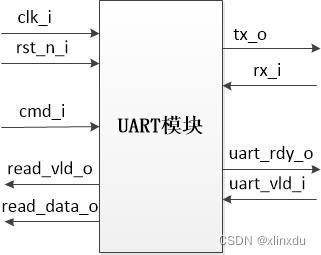
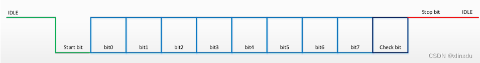

# UART_TR-RR

This design is done without concerns of connecting to APB protocol.

1. UART Transmitter and Receiver Implementation along with reference designs and testbenches.
2. Simulation waveform screenshots are provided.
3. Performance comparisons are done.

# UART

This design is designed to connect with APB-UART Bridge.

12/15/2022 Update: Parity bits in RX is of no use. May add error line.

0. Inspired by https://blog.csdn.net/qq_43244515/article/details/124514416

1. UART Architecture

    

2. UART Ports

    

```
    UART Ports

    input               clk,            // 50MHz Clock Signal  
    input               rst_n,          // Reset Negative
    
    input   [15:0]      cmd,            // [15]     : Read/Write 0/1  
                                        // [14:8]   : Address  
                                        // [7:0]    : Data  
    input               uart_valid,     // Valid Signal for UART  
    output              uart_ready,     // Ready Signal for UART  

    output  [7:0]       read_data,      // Date Read through UART  
    output              read_valid,     // Valid Signal for read_data  

    output              tx,             // UART Transitter  
    input               rx              // UART Receiver  
```
```
    UART Transmitter

    input               uart_clk,       // 115200Hz Clock Signal  
    input               rst_n,          // Reset Negative  
    input               tx_en,          // Transmission Enable
    input   [7:0]       tx_in,          // Transmission Data
    output              tx_out,         // Data Out
    output              tx_done         // Transmission Done
```

```
    UART Receiver

    input               uart_clk,       // 115200Hz Clock Signal  
    input               rst_n,          // Reset Negative  
    input               rx_in,          // Date Received
    output  [7:0]       rx_out,         // Data Out
    output              rx_done         // Data Received and Done
```
```
    UART Interface

    input               clk,            // 50 MHz Clock Signal
    output              uart_clk,       // 115200Hz Clock Signal
    input               rst_n,          // Reset Negative

    input   [15:0]      cmd,            // [15]     : Read/Write 0/1  
                                        // [14:8]   : Address  
                                        // [7:0]    : Data
    input               uart_valid,     // Valid Signal for UART  
    output              uart_ready,     // Ready Signal for UART  

    output  [7:0]       tx_data,        // Data to send
    output              tx_en,          // Enable data to send
    input               tx_done,        // Data sent and done
```


3. UART Frame Composition

    

    1 bit of start bit (0),
    8 bits of data,
    1 bit of parity (to make total # of 1s odd),
    1 bit of stop (1)

4. Technical Specs
```
    Bits per Second (BPS)   =   115200
    Clock Frequency         =   50MHz
    Data Width              =   8
    Address Width           =   7
    Command Packe Length    =   16
```
5. Module Bahaviors
```
    UART Interface

        1.  Generate a slower uart clk at 115200Hz
        2.  Once a command packet arrives, decode it and execute
        3.  If it's a read operation, send only the address;
            If it's a write operation, send the address (along with Read/Write Bit) first,
                and then send the data
```
```
    UART Transmitter

        1. Once a UART frame arrives (tx_en is ON), initiate sending process
```
```
    UART Receiver

        1. Once a UART frame arrives (0 is detected), receive and decode the data
        2. After the data receiving process is done, send out the received data
```

6. State Information
```
    Interface State Information
    Current State       Next State          Condition
    IDLE                SEND                uart_valid = 1, rst_n = 1
                        IDLE                else
    SEND                WAIT                
    WAIT                SEND                SEND_NEXT = 1 && tx_done = 1
                        IDLE                SEND_NEXT = 0 && tx_done = 1
                        WAIT                tx_done = 0
    
    Interface State Behavior
    Current State       Behavior
    IDLE                uart_clk is generated; uart_ready = 1; tx_en = 0;
                            tx_data = 8'b0; all regs = 0
    SEND                uart_clk is generated; uart_ready = 0; tx_en = 1;
                            if (SEND_NEXT == 1)
                                tx_data <= cmd[7:0]
                                SEND_NEXT <= 0
                            else
                                tx_data <= cmd[15:8]
                                SEND_NEXT <= cmd[15]
    WAIT                uart_clk is generated; uart_ready = 0; tx_en = 0;
```
```
    Transmitter State Information

    Current State       Next State          Condition
    IDLE                SEND                uart_valid = 1, uart_ready = 1, rst_n = 1
                        IDLE                else
    SEND                SEND                Bit Counter < 10 or (uart_valid = 1, uart_ready = 1)
                        IDLE                Bit Counter = 10

    Transmitter State Behavior
    Current State       Behavior
    IDLE                tx_out = 1; tx_done = 0; all regs = 0
    SEND                if (bit_counter == 0)
                            tx_out = 0
                            tx_done = 0
                            bit_counter = bit_counter + 1
                        else if (bit_counter == 10)
                            tx_out = 1
                            tx_done = 1
                            bit_counter = bit_counter + 1
                        else if (bit_counter == 9)
                            tx_out = odd parity bit
                            tx_done = 0
                            bit_counter = bit_counter + 1
                        else
                            tx_out = tx_in[bit_counter - 1]
                            tx_done = 0
                            bit_counter = bit_counter + 1
```
```
    Receiver State Information

    Current State       Next State          Condition
    IDLE                RECEIVE             rx_in = 0, rst_n = 1
                        IDLE                else
    RECEIVE             RECEIVE             Bit Counter < 8 or rx_in = 0
                        IDLE                Bit Counter = 8

    Receiver State Behavior
    Current State       Behavior
    IDLE                rx_out = 8'b0; rx_done = 0; all regs = 0
    RECEIVE             rx_out[bit_counter] = rx_in; bit_counter = bit_counter + 1


```


